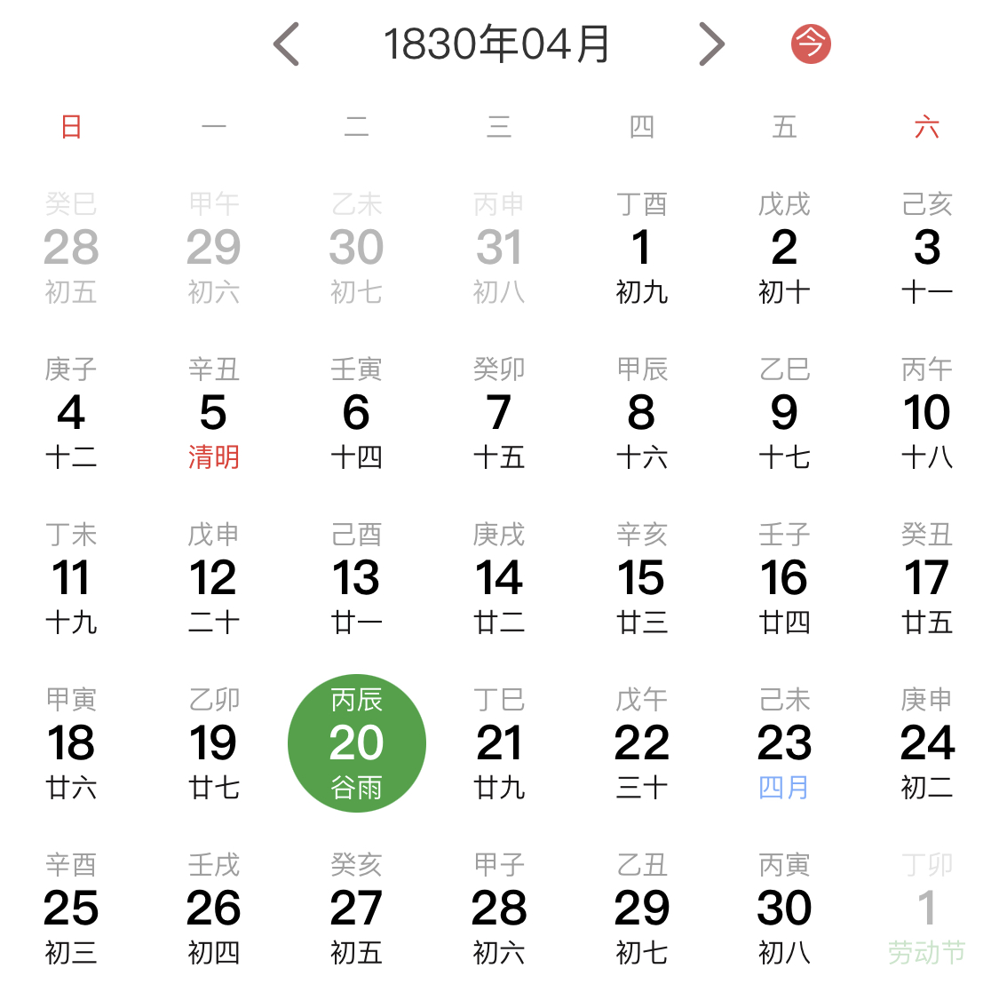

# 项目需求

初期计划只实现几个最基本的功能，即八字信息的录入，对已有八字信息的查询及八字的展示。

## 八字录入

用户录入一般有两种方式，

一是用户输入阳历/阴历日期，比如输入 -> 1963年4月27日8时，需要转换为对应的八字一并进行保存。比如用户可以通过如下界面（微信小程序搜“通俗万年历”）选择日期进行录入：

另一种是用户直接输入八字，比如某人八字为 -> 癸卯 丙辰 庚子 庚辰，则需要转换为对应的阳历/阴历日期一并进行保存。此功能目前只有个别软件支持，但实现效果却不理想。

鉴于第二种方式的具体实现较为复杂，所以前期计划只实现第一种录入方式。

## 八字查询

查询的功能可以做到很丰富，比如针对八字格局查询，针对月令日主查询（e.g. 甲木生寅月）等等，对八字理论的学习研究都有帮助。此功能目前市面上的软件都没有，也是我们软件的一个核心卖点。

数据来源可分为两类，1. 书籍中记载的古代近代名人八字 2. 个人收集的八字

## 八字展示

市面上最常用的两款软件（左：测测，右：八字排盘宝）的八字展示效果如下，颜值左边略高，专业性右边略高，需要将两者进行一个综合。

前期计划只需要能够展示必要信息，颜值、专业性等暂不考虑

