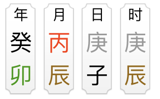

# 各种各样的名词

## 阴阳五行

八字的理论基础是基于阴阳五行，但阴阳是什么，五行又是什么，怎么来的，等等

道德经里提到过“万物负阴而抱阳，冲气以为和”，翻译过来大概是：万物由阴阳构成（抽象的说法），阴阳相互作用（冲气）就能”和“（和字我也不知道怎么解释，三生万物吧）。

类比到计算机就容易理解很多，计算机的程序都是由0（阴）和1（阳）构成的，0和1相互作用（通电），程序就能运行。从计算机的角度，阴阳就可以理解为**运动的**0和1。

五行是基于阴阳产生的，行字本身就有“流行”，”运动“的含义，所以五行就是：五种运动着的气（能量）。

那五行是怎么来的呢，把阴阳再分阴阳，即为阳中阳（11），阳中阴（10），阴中阳（01），阴中阴（00）。我们给他们取个名字，阳中阳->太阳->**火**，阳中阴->少阳->**木**，阴中阳->少阴->**金**，阴中阴->太阴->**水**

水和火，金和木相冲（冲气），给它取个名字叫**土**，五行就这么来的，相当于是对阴阳的一个细化。

需要注意两点

- 阴阳，五行可以对应（取象）到各种实体物质，但是其本身并不是具体的物质。
- 阴阳，五行都是运动的，变化的，可以相互制约，转换的

## 十天干，十二地支，六十甲子

十天干分别是：甲、乙、丙、丁、戊、己、庚、辛、壬、癸，他们是对五行的再一次细化，五行再分阴阳（111，110...000）

规则是：甲为阳木，乙为阴木，丙为阳火，丁为阴火...  阳天干：甲丙戊庚壬，阴天干：乙丁己辛癸

口诀：东方甲乙寅卯木, 南方丙丁巳午火, 西方庚辛申酉金, 北方壬癸亥子水, 戊己辰戌丑未土

十二地支分别是：子、丑、寅、卯、辰、巳、午、未、申、酉、戌、亥。可以理解为天干的能量在地上的一个表现，所以每个地支都包含不同成分的天干能量。

天干能量相对纯，地支能量相对杂，地支可以类比为一个数组，数组里的元素为天干，不同的地支里数组的元素，次序各不相同，比如 寅=['甲', '丙', '戊']，数组里的元素我们叫它**地支藏干**，要是问怎么来的，只能说是古人根据不同季节月份的能量，定义出来的。

为什么是十二个地支呢，因为一年分二十四个节气（十二节，十二气）

天干地支进行一个排列组合，参考 https://6tail.cn/calendar/api.html#lunar.ganzhi.html ，就有了六十甲子。

## 四柱八字

古人经常用六十甲子表示的干支来计时（古文里经常可以看到），就是天干地支组成的->年月日时，像下面这个：

除了用来计时外，它还体现了那个时间点的一个能量组合，根据这个能量组合，就可以进行算命。

从图上可以看到，四柱就是年柱，月柱，日柱，时柱，因为是竖着写的，像个柱子。

八字就是一共有八个字。

### 八字里的各种术语：月令，日主，十神，神煞等等等

月柱的地支，简称月支，一般叫他**月令**

日柱的天干，简称日干，一般叫他**日主**