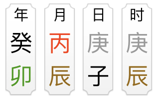

# 各种各样的名词 之 源数据

## 阴阳五行

八字的理论基础是基于阴阳五行，但阴阳是什么，五行又是什么，怎么来的，等等

道德经里提到过“万物负阴而抱阳，冲气以为和”，翻译过来大概是：万物由阴阳构成（抽象的说法），阴阳相互作用（冲气）就能”和“（和字我也不知道怎么解释，三生万物吧）。

类比到计算机就容易理解很多，计算机的程序都是由0（阴）和1（阳）构成的，0和1相互作用（通电），程序就能运行。从计算机的角度，阴阳就可以理解为**运动的**0和1。

五行是基于阴阳产生的，行字本身就有“流行”，”运动“的含义，所以五行就是：五种运动着的气（能量）。

那五行是怎么来的呢，把阴阳再分阴阳，即为阳中阳（11），阳中阴（10），阴中阳（01），阴中阴（00）。我们给他们取个名字，阳中阳->太阳->**火**，阳中阴->少阳->**木**，阴中阳->少阴->**金**，阴中阴->太阴->**水**

水和火，金和木相冲（冲气），给它取个名字叫**土**，五行就这么来的，相当于是对阴阳的一个细化。

需要注意两点，下面详细讲

- 阴阳，五行可以对应（取象）到各种实体物质，但是其本身并不是具体的物质。
- 阴阳，五行都是运动的，变化的，可以相互制约，转换的

### 五行的取象（类的实例化）

木 火 土 金 水

按季节取向：春 夏 长夏 秋 东

按方位取象：东 南 中 西 北

按颜色取象：绿 红 黄 白 黑

### 五行的生克制化

摘自 四聖心源 清 黃元御

> 五行之理，有生有剋，木生火，火生土，土生金，金生水，水生木，木剋土，土剋水，水剋火，火剋金，金剋木。其相生相剋，皆以氣而不以質也，成質則不能生剋矣。
>
> 蓋天地之位，北寒、南熱、東溫、西涼。陽升於東，則溫氣成春，升於南，則熱氣成夏，陰降於西，則涼氣成秋，降於北，則寒氣成冬。春之溫生夏之熱，夏之熱生秋之涼，秋之涼生冬之寒，冬之寒生春之溫。土為四象之母，實生四象，曰火生土者，以其寄宮在六月火令之後，六月濕盛，濕為土氣也。其實水火交蒸，乃生濕氣，六月之時，火在土上，水在土下，寒熱相逼，是以濕動。濕者，水火之中氣。土寄位於西南，南熱而西涼，故曰火生土，土生金也。
>
> 相剋者，制其太過也。木性發散，斂之以金氣，則木不過散；火性升炎，伏之以水氣，則火不過炎；土性濡濕，疏之以木氣，則土不過濕；金性收斂，溫之以火氣，則金不過收；水性降潤，滲之以土氣，則水不過潤，皆氣化自然之妙也。

有制约，生化，才能维持系统的稳定。只有制约，系统难运行。只有生化，系统运行速度无法控制。都是偏于一端。

## 十天干，十二地支，六十甲子

十天干分别是：甲、乙、丙、丁、戊、己、庚、辛、壬、癸，他们是对五行的再一次细化，五行再分阴阳（111，110...000）

规则是：甲为阳木，乙为阴木，丙为阳火，丁为阴火...  阳天干：甲丙戊庚壬，阴天干：乙丁己辛癸

口诀：东方甲乙寅卯木, 南方丙丁巳午火, 西方庚辛申酉金, 北方壬癸亥子水, 戊己辰戌丑未土

十二地支分别是：子、丑、寅、卯、辰、巳、午、未、申、酉、戌、亥。

### 在八字里地支代表什么

为什么是十二个呢，因为一年分二十四个节气（十二节，十二气），一天分十二个时辰，所以地支也用来描述月份和时辰。

地支可以理解为不同时间段，地面上的一种能量，这种能量由天干排列组合而成。

比如寅月，代表立春到惊蛰这段时间，见上图。寅时，普遍说法是表示凌晨3-5点，不过有待商榷。

天干能量相对纯，地支能量相对杂，地支可以类比为一个数组，数组里的元素为天干，不同的地支里数组的元素，次序各不相同，比如 寅=['甲', '丙', '戊']，数组里的元素我们叫它**地支藏干**，要是问怎么来的，只能说是古人根据不同季节月份的能量，定义出来的。

天干地支进行一个排列组合，参考 https://6tail.cn/calendar/api.html#lunar.ganzhi.html ，就有了六十甲子。

### 有多少个八字

八字每柱有60种可能，但月柱受年柱的制约，时柱受日柱的制约，制约的规则参考[五龙遁](./干支历与西历互相转换算法.md#2五龙遁算法)，所以实际上月柱和时柱只有12种可能性

所以八字所有可能的排列组合为60x12x60x12，另外八字分男女，所以还需要在乘以2，一共有1036800种

## 四柱八字

古人经常用六十甲子表示的干支来计时（古文里经常可以看到），就是天干地支组成的->年月日时，像下面这个：

除了用来计时外，它还体现了那个时间点的一个能量组合，根据这个能量组合，就可以进行算命。

从图上可以看到，四柱就是年柱，月柱，日柱，时柱，因为是竖着写的，像个柱子。八字就是一共有八个字。

另外八字一定要指明性别，术语是 男：乾造，女：坤造。所以八字+性别就构成了最原始的源数据，其他等等的都是根据算法弄出来的衍生数据

### 八字里的其他术语：月令，日主，十神，神煞等等等（衍生数据）

月柱的地支，简称月支，一般叫他**月令**

日柱的天干，简称日干，一般叫他**日主**

神煞较多，另外写了一篇，其他还有很多名词的定义，算法，参考下面这些链接。这些相对八字，都是衍生数据，但是算命需要这些所有数据，所以对于算命先生来说，这些又都是源数据。

具体的下篇再讲
